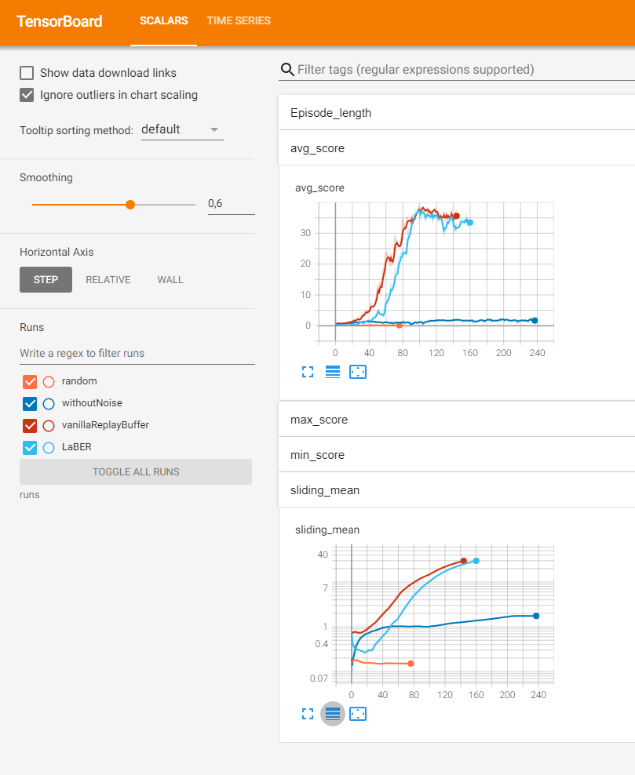

[//]: # (Image References)

[image1]: https://user-images.githubusercontent.com/10624937/43851024-320ba930-9aff-11e8-8493-ee547c6af349.gif "Trained Agent"


# Project 2: Continuous control

![Trained Agent][image1]

Here you can find my solution to the 2nd project of the Udacity Deep RL course.
A detailed report of my solution and changes to code provided my Udacity you can find in the [Report.md](Report.md)

In this environment, a double-jointed arm can move to target locations. A reward of +0.1 is provided for each step that the agent's hand is in the goal location. Thus, the goal of your agent is to maintain its position at the target location for as many time steps as possible.

The observation space consists of 33 variables corresponding to position, rotation, velocity, and angular velocities of the arm. Each action is a vector with four numbers, corresponding to torque applicable to two joints. Every entry in the action vector should be a number between -1 and 1.

In the Udacity course there exist two versions of the environment, one with just one single agent, and a second version that contains 20 identical agents, each with its own copy of the environment. In this repo we focus on the later one.

In order to to solve the challenge, the agents must get an average score of +30 (over 100 consecutive episodes, and over all agents). Specifically,
- After each episode, we add up the rewards that each agent received (without discounting), to get a score for each agent. This yields 20 (potentially different) scores.  We then take the average of these 20 scores. 
- This yields an **average score** for each episode (where the average is over all 20 agents).
The environment is considered solved, when the average (over 100 episodes) of those average scores is at least +30. 


### Getting Started

1. Download the environment for 20 agents from one of the links below.  You need only select the environment that matches your operating system:
    - Linux: [click here](https://s3-us-west-1.amazonaws.com/udacity-drlnd/P2/Reacher/Reacher_Linux.zip)
    - Mac OSX: [click here](https://s3-us-west-1.amazonaws.com/udacity-drlnd/P2/Reacher/Reacher.app.zip)
    - Windows (32-bit): [click here](https://s3-us-west-1.amazonaws.com/udacity-drlnd/P2/Reacher/Reacher_Windows_x86.zip)
    - Windows (64-bit): [click here](https://s3-us-west-1.amazonaws.com/udacity-drlnd/P2/Reacher/Reacher_Windows_x86_64.zip)
    
    (_For Windows users_) Check out [this link](https://support.microsoft.com/en-us/help/827218/how-to-determine-whether-a-computer-is-running-a-32-bit-version-or-64) if you need help with determining if your computer is running a 32-bit version or 64-bit version of the Windows operating system.


2. Unzip (or decompress) the file.

3. Add the path of the environment to the `config.py`
- **Mac**: `PATH_TO_CC="path/to/Reacher.app"`
- **Windows** (x86): `PATH_TO_CC="path/to/Reacher_Windows_x86/Reacher.exe"`
- **Windows** (x86_64): `PATH_TO_CC="path/to/Reacher_Windows_x86_64/Reacher.exe"`
- **Linux** (x86): `PATH_TO_CC="path/to/Reacher_Linux/Reacher.x86"`
- **Linux** (x86_64): `PATH_TO_CC="path/to/Reacher_Linux/Reacher.x86_64"`
- **Linux** (x86, headless): `PATH_TO_CC="path/to/Reacher_Linux_NoVis/Reacher.x86"`
- **Linux** (x86_64, headless): `PATH_TO_CC="path/to/Reacher_Linux_NoVis/Reacher.x86_64"`

4. Create a new python virtual env with python 3.6 and activate it.

5. Install the required python packages:
```bash
    cd python
    pip install .
```

Please note this from the [Udacity Deep RL repo](https://github.com/udacity/deep-reinforcement-learning) to assure the same behavior. I just extended the requirements by `tqdm` which I use for visualization.

In case you already have an python env from the Udacity course, feel free to just
```bash
pip install tqdm
```

### Play / Inference

In this repo you find the weights for a fully trained agent in the `checkpoint.pth`.
In order to watch a game you can just start the `play.py`
```bash
python play.py
```

### Training

In order to start a new training from just execute the `train.py` script.
```bash
python train.py
```

In my case it did take 144 episodes to achieve the metric.


If you install xtensorboard
```bash
pip install xtensorboard
```

you can also see all metrics in tensorboard

```bash
tensorboard --logdir runs
```




# Search for hyperparameter

If you want to search for even better hyperparameter, feel free to use (and adapt) the `search.py` script.
All you need is to install ray tune and the according bayesian optimizer.

```bash
pip install ray
pip install bayesian-optimization
```

Note: I did find the hyperparamter here by manual trial and error and did NOT use this script here.

# Code structure

Note that the following files are identical in all my Udacity projects, so I could reuse the code easier:

```
agents.py
environment.py
memory.py
model.py
training.py
```
