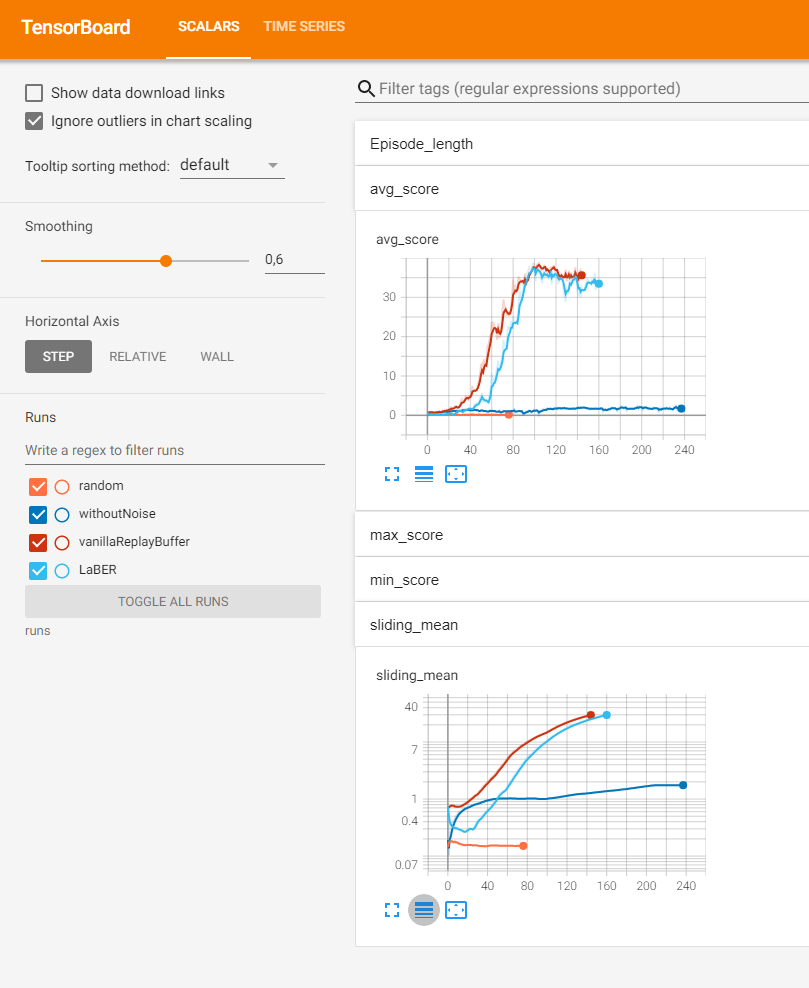

# Report for project 2: Continues control

The goal of this project is to train an agent that moves a double-jointed arm to target locations. For more detailed description have a look at the [README.md](README.md). The task is solved if the sliding mean (over 100 episodes of the mean reward for all 20 agents) is above 30.

## Learning Algorithm
In this project we face continues action and state space, which makes it less suited for a DQN agent. Therefore I decided to go for DDPG approach. Starting point was the code provided in the Udacity course.
To understand the problem at hand better, I decided to start first with the env that includes just one agent.

### Baseline
To contrast progress by a learned agent, I created a random agent first:

```python
class RandomContinues(Agent):
    def __init__(self, action_size) -> None:
        """A random agent returning a continues action between -1 and 1."""

        super().__init__()
        self.action_size = action_size

    def act(self, state):
        batch_size = state.shape[0]
        return np.random.uniform(-1.0, 1.0, (batch_size, self.action_size))

    def step(self, state, action, reward, next_state, done) -> None:
        pass
```

With this agent the sliding mean was around ~0.18.

### Following Udacity tipps

In the section of benchmark implementation there were already some nice findings explained which help the stability of the DDPG so adapted them in my code:

- Adding gradient clipping
```python
self.critic_optimizer.zero_grad()
critic_loss.backward()
torch.nn.utils.clip_grad_norm(self.critic_local.parameters(), 1)
self.critic_optimizer.step()
```
- Update Strategy: Update the agent 10x after 20 timesteps
```python
        # Learn every UPDATE_EVERY time steps.
        self.t_step = (self.t_step + 1) % self.learn_every_step
        if self.t_step == 0:
            # If enough samples are available in memory, get random subset and learn
            if self.memory.ready_to_sample():
                for _ in range(self.learn_steps):
                    states, actions, rewards, next_states, dones = self.memory.sample()
                    self.learn(states, actions, rewards, next_states, dones)
```
- Adding Ornstein-Uhlenbeck noise for exploration.

Since stability seems to be a point a also added a batch normalizer to both networks (actor and critic).

Looking at the training of a single agent, I still could not reproduce the behavior that was shown on the Udacity site for a single agent. I my case training was still unstable.

### Fixing(?) Ornstein-Uhlenbeck process
While searching for potential problems in my implementation, I also had  a look at the code for the Ornstein-Uhlenbeck process I got from the Udacity repo. But it seems to be wrong: The action space is in all continues environments between -1.0 and 1.0. But the noise created by the code is only between 0.0 and 1.0. 

So I changed the following line:
```python
dx = self.theta * (self.mu - x) + self.sigma * np.array(
    [random.random() for i in range(len(x))]
)
```

to

```python
dx = self.theta * (self.mu - x) + self.sigma * np.array(
    [random.uniform(-1, 1) for i in range(len(x))]
)
```
Basically I replaced `random.random()` by `random.uniform(-1, 1)`. The first one is only between 0 and 1, and the later between -1 and 1 which leads to the behavior I would expect.

# Hyperparameter
After playing around I ended up with following hyperparamter:

```python
"tau": 1e-3,
"gamma": 0.99,
"lr_actor": 1e-3,
"lr_critic": 1e-3,
"weight_decay_critic": 0.0,
"noise_sigma": 0.4,
"noise_theta": 0.15,
"learn_every_step": 20,
"learn_steps": 10,
```

Both actor and critic consist of 3 layers with 200 units in the first hidden layer and and 100 and second one, both activated by a RELU.

# Changing back from 1 to 20
Since I had problems with stable training of a single agent, I did expect that changing to 20 agents may add more stability (because of smoothed gradients).
The result was even higher then my hopes: The agents had a stable training and I converged in 144 episodes.

# Memory

For the [3rd Udacity](https://github.com/VitaliKaiser/udacity_drl_p3_collab-compet/blob/main/Report.md) project I implemented the paper ["Large Batch Experience Replay"](https://arxiv.org/abs/2110.01528) and tried it out also here. With the hyperparameter choice here it did need a bit longer to converge (160 episodes). But this could be due to the not suited hyperparameter.

Here is on tensorboard screenshot of the learning curves:



Please note that the sliding mean is in tensorboard log scale!
- random (orange): The random agent described as baseline.
- without Noise (dark blue): The DDPG agent without noise.
- vanillaReplayBuffer (red): The DDPG agent with noise and the vanilla Replay Buffer.
- LaBER (blue): The DDPG agent with noise and the LaBER memory.


## Ideas for Future Work

### Benchmarking Deep Reinforcement Learning for Continuous Control
As stated in [Benchmarking Deep Reinforcement Learning for Continuous Control]() Trust Region Policy Optimization (TRPO) and Truncated Natural Policy Gradient (TNPG) seem to stabilize training. It would be interesting to see how much faster the agent could converge with those approaches.

### NoisyNetwork
In my current DDPG approach I am using noise from the Ornstein-Uhlenbeck process in order to control the exploration. ["Noisy Networks for Exploration"](https://arxiv.org/abs/1706.10295) in contrast seemed to be very practical since the adapt the noise during training and claim to get give better training signal.

### Hyperparameter search
As mentioned before, my hyperparameter search was just trial and error and I assume there are even better ones.
I wrote my code in way so its very easy to run a hyperparameter search with "ray tune". Check out the `search.py`.
I did run it for a short while, but since the parameter space is already quite big and did not find any good combination.
But I assume with enough time and computing power you could find better.
